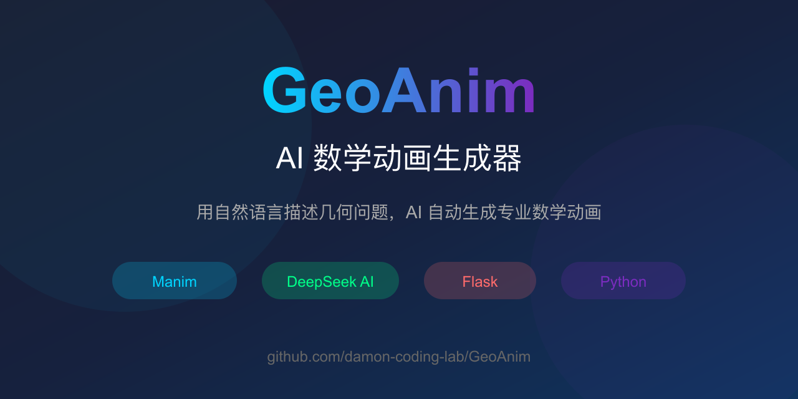

# GeoAnim - AI 数学动画生成器

> 用自然语言描述几何问题，AI 自动生成专业数学动画



[English](README_en.md) | 简体中文

---

## 🌟 功能特点

- **自然语言输入**：用中文描述几何问题，即可生成动画
- **AI 智能匹配**：DeepSeek AI 理解几何描述，匹配最佳模型
- **Manim 动画引擎**：基于 3Blue1Brown 的 Manim 渲染高质量动画
- **11+ 预置模型**：涵盖初中几何核心模型
- **开源可扩展**：轻松添加新的几何模型

---

## 🎯 效果演示

### 输入描述
```
正方形ABCD，对角线AC上有一动点P，连接BP使BP垂直于AC
```

### AI 分析结果
- 匹配模型：**半角模型（正方形）**
- 所属章节：九上·旋转
- 匹配理由：描述中包含"正方形"、"对角线"、"动点"、"垂直"等关键词

### 生成的动画效果
点击模型卡片即可播放对应几何动画，观看动点 P 沿对角线运动时 BP 始终垂直于 AC 的动态演示。

---

## 📚 预置模型库

| 模型 | 章节 | 描述 |
|------|------|------|
| 📐 手拉手模型 | 七下·全等三角形 | 两个三角形通过旋转重合 |
| 🏇 将军饮马 | 八上·轴对称 | 河边饮马最短路径问题 |
| 📐 半角模型 | 九上·旋转 | 正方形中的半角旋转全等 |
| ⭕ 隐圆模型 | 九上·圆 | 到定点距离等于定长的点的轨迹 |
| 📏 一线三等角 | 八下·四边形 | 同位角相等推出平行线 |
| ✂️ 倍长中线 | 八上·全等三角形 | 倍长中线构造全等三角形 |
| ⭐ 费马点 | 九下·锐角三角函数 | 使PA+PB+PC最小的点 |
| 🎯 弦图模型 | 八下·勾股定理 | 弦图证明勾股定理 |
| 🦶 脚拉脚模型 | 九上·圆 | 圆外一点的切线长定理 |
| 📍 胡不归模型 | 中考压轴 | 加权最短路径问题 |
| 📐 切割线定理 | 九上·圆 | 切线长与割线的乘积关系 |

---

## 🚀 快速开始

### 环境要求

- Python 3.9+
- FFmpeg
- DeepSeek API Key（[免费获取](https://platform.deepseek.com/)）

### 安装

```bash
# 克隆项目
git clone https://github.com/damon-coding-lab/GeoAnim.git
cd GeoAnim

# 创建虚拟环境
python -m venv venv
source venv/bin/activate  # Windows: venv\Scripts\activate

# 安装依赖
pip install -r requirements.txt

# 配置 API Key
export DEEPSEEK_API_KEY="your-api-key-here"

# 运行
python app.py
```

打开浏览器访问 `http://localhost:5001`

---

## 💡 使用案例

### 案例1：教师备课

数学老师想要制作"将军饮马"的教学视频，只需输入：

```
在直线l同侧有两点A、B，在l上找一点P使AP+PB最小
```

系统自动匹配并生成动画，老师可以直接用于课堂演示。

### 案例2：学生复习

学生想理解"半角模型"的原理，输入：

```
正方形ABCD，E是CD上一点，AE平分∠DAB，连接BE
```

AI 分析后生成旋转全等的动画演示，帮助理解模型。

### 案例3：内容创作

数学博主想要制作几何科普视频，输入：

```
等边三角形ABC内有一点P，PA=PB=PC
```

生成费马点的动画，作为视频素材。

---

## 🏗️ 技术架构

```
┌─────────────────────────────────────────────────────────┐
│                     Flask Web App                        │
├─────────────────────────────────────────────────────────┤
│  用户输入 → AI分析 → 模型匹配 → 动画渲染 → 视频返回     │
└─────────────────────────────────────────────────────────┘
         │                                    │
         ▼                                    ▼
┌─────────────────┐                  ┌─────────────────┐
│   DeepSeek AI   │                  │  Manim Engine   │
│  (自然语言理解)  │                  │  (动画渲染)      │
└─────────────────┘                  └─────────────────┘
```

### 核心组件

| 组件 | 技术 | 说明 |
|------|------|------|
| **AI 理解层** | DeepSeek Chat API | 分析用户描述，提取几何要素 |
| **模型匹配层** | 关键词 + 语义匹配 | 从预置模型中选择最佳匹配 |
| **动画渲染层** | Manim Community | 生成高质量数学动画 |
| **Web 展示层** | Flask + HTML/CSS | 提供交互界面 |

---

## 📁 项目结构

```
GeoAnim/
├── scenes/                    # Manim 动画场景
│   ├── hand_in_hand.py        # 手拉手模型
│   ├── general_drink_horse.py # 将军饮马
│   ├── half_angle_square.py   # 半角模型
│   └── ...
├── media/                     # 渲染输出的视频
│   └── videos/
├── templates/                 # Flask 模板
│   └── index.html
├── static/                    # 静态资源
│   └── css/
│       └── style.css
├── app.py                     # Web 应用主文件
├── requirements.txt           # Python 依赖
└── README.md
```

---

## 🔧 添加新模型

### 步骤1：创建动画场景

在 `scenes/` 目录创建新的 Manim 场景文件：

```python
from manim import *

class NewModel(Scene):
    def construct(self):
        # 你的几何动画代码
        circle = Circle(radius=2)
        self.play(Create(circle))
```

### 步骤2：注册模型

在 `app.py` 的 `PRESET_MODELS` 中添加：

```python
"new_model": {
    "name": "新模型名称",
    "chapter": "年级·章节",
    "description": "模型描述",
    "video": "new_model/720p30/NewModel.mp4"
}
```

### 步骤3：添加关键词映射

在 `AVAILABLE_MODELS` 中添加：

```python
"新模型关键词": "new_model",
```

### 步骤4：渲染视频

```bash
python -m manim render scenes/new_model.py NewModel -qm
```

---

## 🔌 API 调用

### 生成动画

```bash
curl -X POST http://localhost:5001/api/generate \
  -H "Content-Type: application/json" \
  -d '{"description": "正方形ABCD，对角线AC上有一动点P"}'
```

### 获取模型列表

```bash
curl http://localhost:5001/api/models
```

### 获取模型视频

```bash
curl http://localhost:5001/api/models/half_angle_square/video \
  -o video.mp4
```

---

## 📊 成本分析

| 操作 | DeepSeek 消耗 | 预估成本 |
|------|---------------|----------|
| 单次 AI 分析 | ~100 tokens | ¥0.001 |
| Manim 渲染 | CPU 渲染 | 免费 |
| 视频存储 | 本地/云存储 | 用户自控 |

**实测**：生成一个几何动画，AI 分析费用约 **¥0.01**

---

## 🤝 贡献

欢迎提交 Issue 和 Pull Request！

1. Fork 本仓库
2. 创建特性分支 (`git checkout -b feature/AmazingFeature`)
3. 提交更改 (`git commit -m 'Add AmazingFeature'`)
4. 推送到分支 (`git push origin feature/AmazingFeature`)
5. 创建 Pull Request

---

## 📄 许可证

本项目采用 MIT 许可证 - 详见 [LICENSE](LICENSE) 文件

---

## 🔗 相关链接

- [Manim 官方文档](https://docs.manim.community/)
- [DeepSeek API](https://platform.deepseek.com/)
- [3Blue1Brown Manim](https://github.com/3b1b/manim)

---

## 联系方式

- GitHub: https://github.com/damon-coding-lab/GeoAnim
- Issues: https://github.com/damon-coding-lab/GeoAnim/issues

---

*Built with ❤️ using Manim + DeepSeek AI*
